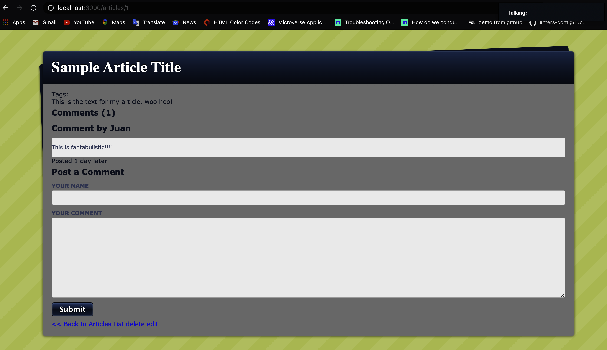

# Blog App Example

> This is a blog app built to practice development with Ruby on Rails

Additional description about the project and its features.

## Built With

- Ruby on Rails,

## Live Demo

[Live Demo Link](https://powerful-atoll-03118.herokuapp.com/)

## Authors

👤 **Paul Balitema**

- Github: [@pbkabali](https://github.com/pbkabali)
- Twitter: [@pbkabali](https://twitter.com/pbkabali)
- Linkedin: [[engineerbpk](www.linkedin.com/in/engineerbpk)

👤  **Juan Jacobo Hincapie Montes**

- Gmail: [@gmail](jacobo12.montes@gmail.com)
- Github: [@githubhandle](https://github.com/jacobo12montes)
- Twitter: [@twitterhandle](https://twitter.com/HincapieMontes)
- Linkedin: [linkedin](https://www.linkedin.com/in/juan-jacobo-hincapi%C3%A9-montes-93975210b/)

## 🤝 Contributing

Contributions, issues and feature requests are welcome!

Feel free to check the [issues page](https://github.com/pbkabali/Rails-Blog-App/issues).

## Show your support

Give a ⭐️ if you like this project!

## Acknowledgments

- [JumpStart Labs](http://tutorials.jumpstartlab.com)

## 📝 License

This project is [MIT](https://opensource.org/licenses/MIT) licensed.
